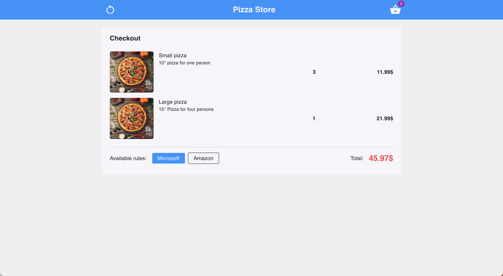
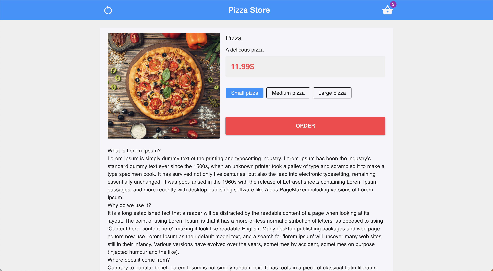
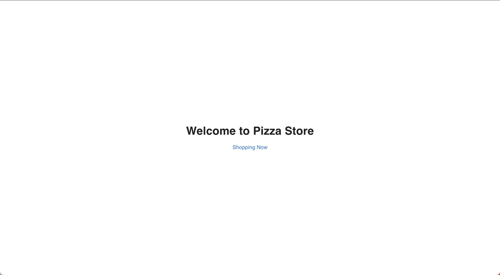

## Pizza store

 

### Basic Overview - [Live Demo](https://oolio.tomiez.com)

A full-stack web application is built upon React.js (frontend) and Express.js (backend) without persistent database to simulate an online shopping flow and allow to apply rules to get a better price.

#### Features

- Add product to checkout
- Apply rules when checkout
- Only list available rules based on specific products
- Show checkout total price
- Restart shopping flow (logout)

#### Technical highlights

###### Frontend

- Applied **Presentational pattern** for clean code and testable
- Applied modern **React** feature to avoid wasted rerender and unnecessary variables such as **custom hook**, **memo**, **useMemo**, **Context**
- Code-splitting
- Clean & consistent UI
- Error handling
- Theming
- Dockerized
- Accessibility and user friendly
- Enable gzip + HTTPS on server

###### Backend

- Applied **MVC** structure
- Dockerized

#### TODO

- Writting more test for frontend (currently coverage ~50%)
- Writing tests for backend
- Implement **Cypress** for end-to-end testing
- Update for responsive

### Getting started

#### Requirements

- Node.js >= 16.17.0
- yarn >= 1.22.17

###### Frontend

```javascript
/* First, move to frontend folder */
cd ./client

/* Then, Install the needed packages */
yarn install

/* Then start the app */
yarn start

/* To run the tests */
yarn test

```

###### Backend

```javascript

/* First, move to backedn folder */
cd ./server

/* Then, Install the needed packages */
yarn install

/* Then start the app */
yarn dev

```

#### Screenshot

|                   Checkout                    |                   Product                    |
| :-------------------------------------------: | :------------------------------------------: |
|  |  |

|                   Home                    |                   Not found                   |
| :---------------------------------------: | :-------------------------------------------: |
|  |  |

#### Author

Hiep Nguyen
tom.hiepnguyen@gmail..com
